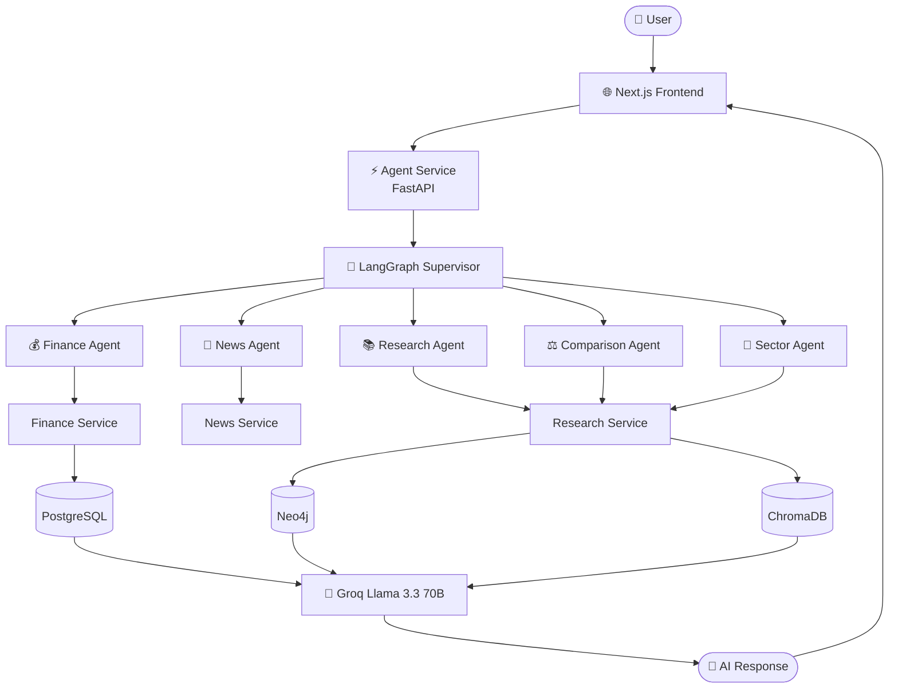
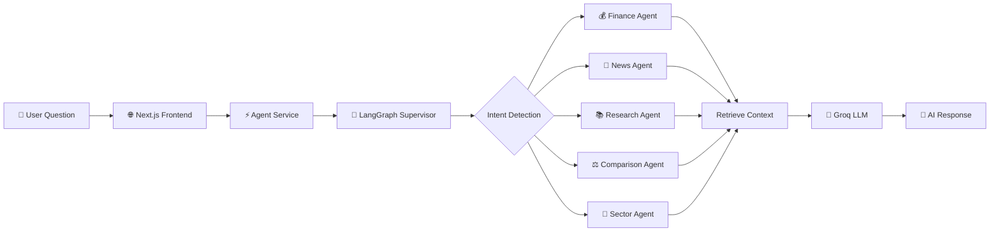
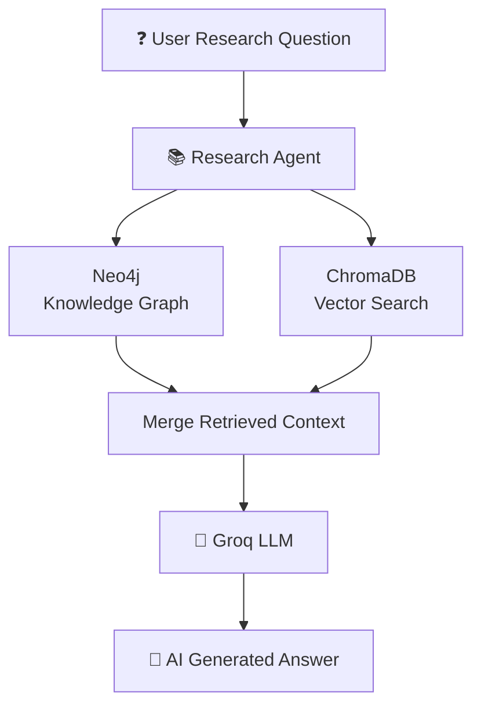
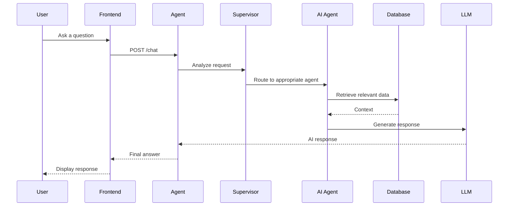
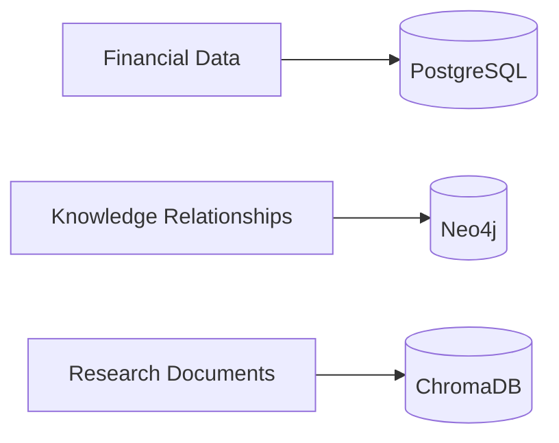
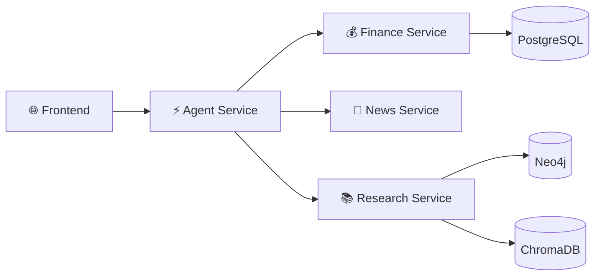
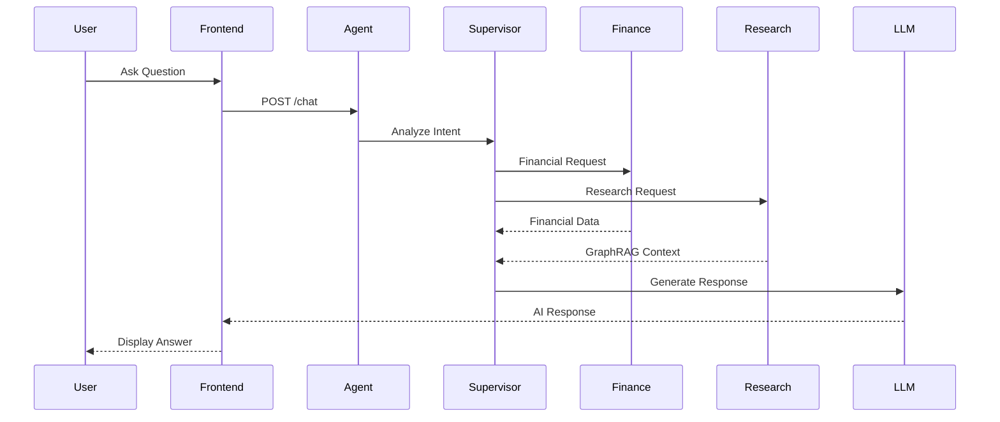

# 🚀 Intel AI Trading Research Platform

<p align="center">

A production-style **Multi-Agent AI Trading Research Platform** for intelligent stock research, company comparison, sector analysis, and financial insights for **NIFTY 50** companies.

Built using **LangGraph**, **Hybrid GraphRAG**, **FastAPI Microservices**, **Next.js**, **Neo4j**, **ChromaDB**, **PostgreSQL**, and **Groq LLM**.

</p>

<p align="center">


</p>

---

# 📖 Overview

Intel AI Trading Research Platform is an AI-powered research assistant designed to simplify equity research for **NIFTY 50** companies.

Traditional investment research requires switching between multiple financial websites, research reports, company filings, and news sources. This platform unifies those tasks into a single AI-powered conversational interface.

Users can ask natural language questions such as:

- Should I invest in Infosys?
- Compare Infosys and TCS.
- Summarize the latest news about Reliance.
- Analyze the Banking sector.
- Give me the financial overview of HDFC Bank.

The platform intelligently routes every request to specialized AI agents using **LangGraph**, retrieves relevant information from structured and unstructured data sources using **Hybrid GraphRAG**, and generates a comprehensive response using **Groq's Llama 3.3 70B** model.

---

# 🎯 Project Objectives

The primary objectives of this project are:

- Build a production-style Multi-Agent AI architecture.
- Demonstrate LangGraph-based agent orchestration.
- Combine GraphRAG and Vector RAG into a Hybrid GraphRAG pipeline.
- Provide intelligent financial research for NIFTY 50 companies.
- Design scalable FastAPI microservices.
- Develop a modern and reusable Next.js frontend.
- Showcase production-oriented software engineering practices.

---

# ✨ Key Highlights

- 🤖 Multi-Agent AI Platform
- 🧠 LangGraph Supervisor Agent
- 🔎 Hybrid GraphRAG Architecture
- 📈 Financial Data Analysis
- 🏢 Company Research
- 📊 Company Comparison
- 🏦 Sector Intelligence
- 📰 AI-powered News Summarization
- ⚡ FastAPI Microservices
- 🌐 Modern Next.js Frontend
- 🗄️ Neo4j Knowledge Graph
- 📚 ChromaDB Vector Search
- 🐘 PostgreSQL Financial Database
- 🚀 Docker-based Deployment

---

# 🌟 Key Features

| Feature | Description |
|----------|-------------|
| 🤖 AI Research Assistant | Ask natural language questions about NIFTY 50 companies. |
| 🏢 Company Explorer | View financial summaries, research insights, and latest news for individual companies. |
| 📊 Company Comparison | Compare two companies using AI-generated financial and business analysis. |
| 🏦 Sector Analysis | Generate AI-powered reports for Banking, IT, FMCG, Energy, and other sectors. |
| 📰 News Intelligence | Summarize recent company news with contextual insights. |
| 💹 Financial Analytics | Retrieve stock prices, trading volume, and historical data. |
| 🧠 LangGraph Supervisor | Automatically routes user queries to the appropriate AI agent. |
| 🔎 Hybrid GraphRAG | Combines Knowledge Graph retrieval and Vector Search retrieval. |
| ⚡ FastAPI Microservices | Independent backend services for scalability and maintainability. |
| 🎨 Modern UI | Responsive Next.js interface built with Tailwind CSS and shadcn/ui. |

---

# 🚀 Why This Project?

Financial research often requires gathering information from multiple disconnected sources, including stock exchanges, company reports, financial news, and research articles.

This project demonstrates how a **Multi-Agent AI architecture** can automate that workflow by combining specialized AI agents with modern retrieval techniques such as **Hybrid GraphRAG**.

Instead of manually searching across multiple platforms, users can interact with a single AI assistant capable of delivering comprehensive, context-aware responses.

---
---

# 🏗️ System Architecture

The Intel AI Trading Research Platform follows a **production-style microservice architecture** powered by a **LangGraph Supervisor Agent**.

The frontend communicates with the Agent Service, which intelligently routes user requests to specialized AI agents. These agents retrieve data from multiple backend services and databases before generating a final AI response.



---

# 🤖 Multi-Agent Workflow

Every user request follows the workflow below.



---

# 🔎 Hybrid GraphRAG Architecture

The Research Agent combines **Knowledge Graph Retrieval** with **Vector Similarity Search** to provide richer and more context-aware answers.



---

# 👥 AI Agents

The platform consists of specialized AI agents, each responsible for a specific task.

| Agent | Responsibility |
|--------|----------------|
| 💰 Finance Agent | Retrieves stock prices, trading volume, financial summaries, and historical market data. |
| 📰 News Agent | Retrieves and summarizes company-specific news articles. |
| 📚 Research Agent | Performs Hybrid GraphRAG retrieval using Neo4j and ChromaDB. |
| ⚖️ Comparison Agent | Compares companies using finance, research, and news data. |
| 🏦 Sector Agent | Generates AI-powered sector analysis and market outlook. |

---

# 🔄 End-to-End Request Lifecycle

The following diagram illustrates how a user's question travels through the system.



---

# 🏛️ Why Multi-Agent Architecture?

Instead of relying on a single AI model for every request, the platform delegates work to specialized AI agents.

### Benefits

- Better task specialization
- Improved response accuracy
- Easier scalability
- Modular architecture
- Independent backend services
- Simplified maintenance
- Faster feature development
- Production-ready design

---

# 💡 Why Hybrid GraphRAG?

Traditional Vector RAG retrieves documents based only on semantic similarity.

Hybrid GraphRAG enhances retrieval by combining:

- **Neo4j Knowledge Graph**
  - Entity relationships
  - Company connections
  - Sector hierarchy
  - Business relationships

- **ChromaDB Vector Search**
  - Semantic document retrieval
  - Research reports
  - News embeddings
  - Financial document similarity

By merging graph-based reasoning with vector-based retrieval, the platform generates more accurate and context-aware AI responses.

---
---

# 🛠️ Technology Stack

The Intel AI Trading Research Platform is built using a modern AI-first technology stack designed for scalability, modularity, and production readiness.

## Frontend

| Technology | Purpose |
|------------|---------|
| **Next.js 16** | React framework for server-side rendering and routing |
| **React 19** | Component-based user interface |
| **TypeScript** | Static type checking and maintainability |
| **Tailwind CSS** | Utility-first styling framework |
| **shadcn/ui** | Modern reusable UI components |
| **Lucide React** | Consistent icon library |

---

## Backend

| Technology | Purpose |
|------------|---------|
| **FastAPI** | High-performance REST API framework |
| **LangGraph** | Multi-Agent orchestration |
| **LlamaIndex** | AI retrieval framework |
| **Pydantic** | Data validation |
| **Groq (Llama 3.3 70B)** | Large Language Model |

---

## Databases

| Technology | Purpose |
|------------|---------|
| **PostgreSQL** | Financial and structured company data |
| **Neo4j** | Knowledge Graph for GraphRAG |
| **ChromaDB** | Vector Database for semantic retrieval |

---

## AI Technologies

| Technology | Purpose |
|------------|---------|
| **LangGraph** | AI agent orchestration |
| **Hybrid GraphRAG** | Combines Graph Retrieval and Vector Retrieval |
| **Groq LLM** | AI response generation |
| **Embeddings** | Semantic search |

---

## DevOps

| Technology | Purpose |
|------------|---------|
| **Docker** | Containerization |
| **Docker Compose** | Multi-service deployment |
| **Git** | Version control |

---

# 📁 Project Structure

The project follows a modular architecture where each service has a single responsibility.

```text
intel-ai-trading-research/
│
├── frontend/
│   ├── app/
│   ├── components/
│   │   ├── chat/
│   │   ├── company/
│   │   ├── compare/
│   │   ├── sector/
│   │   ├── common/
│   │   ├── layout/
│   │   └── ui/
│   │
│   ├── services/
│   ├── constants/
│   ├── lib/
│   ├── types/
│   └── public/
│
├── services/
│   ├── agent-service/
│   ├── finance-service/
│   ├── news-service/
│   └── research-service/
│
├── data/
│
├── docs/
│
├── docker-compose.yml
│
├── .env.example
│
└── README.md
```

---

# 🗄️ Database Architecture

The platform uses multiple databases because each database solves a different problem.



### PostgreSQL

Stores structured financial information.

Examples:

- Company metadata
- Stock prices
- Trading volume
- Historical market data
- Financial summaries

---

### Neo4j

Stores relationships.

Examples:

- Company → Sector
- Company → Industry
- Company → Competitor
- Research entities
- Business relationships

---

### ChromaDB

Stores embeddings.

Examples:

- Research reports
- Company documents
- News articles
- Financial reports
- Semantic search vectors

---

# 🔄 Microservice Architecture

Each backend service is independent.



---

# 📡 Service Responsibilities

| Service | Responsibility |
|----------|----------------|
| **Frontend** | User interface and AI chat experience |
| **Agent Service** | LangGraph workflow orchestration |
| **Finance Service** | Financial market data |
| **News Service** | Company news retrieval |
| **Research Service** | Hybrid GraphRAG retrieval |

---

# 📂 Why Microservices?

Instead of one large backend, the platform is divided into independent services.

### Advantages

- Independent deployment
- Better scalability
- Easier maintenance
- Modular codebase
- Better fault isolation
- Easier testing
- Clear ownership of responsibilities

---

# 🧠 Why Hybrid GraphRAG?

Traditional Retrieval-Augmented Generation (RAG) relies only on vector similarity.

This platform combines:

| Graph Retrieval | Vector Retrieval |
|-----------------|------------------|
| Company relationships | Semantic similarity |
| Sector hierarchy | Research reports |
| Business connections | News articles |
| Entity linking | Financial documents |

This combination enables the AI to provide responses that are both contextually rich and semantically relevant.

---

# 🚀 Design Principles

The platform was built around the following engineering principles:

- **Modularity** – Independent services with clear responsibilities.
- **Scalability** – New AI agents and services can be added with minimal changes.
- **Maintainability** – Reusable components and clean project organization.
- **Extensibility** – Easy integration of new financial datasets, AI models, or backend services.
- **Performance** – Efficient routing and retrieval using LangGraph and Hybrid GraphRAG.
- **User Experience** – Modern, responsive interface with reusable UI components.

---
---

# ⚙️ Getting Started

Follow the steps below to set up and run the Intel AI Trading Research Platform locally.

---

# 📋 Prerequisites

Ensure the following software is installed on your system.

| Software | Version |
|-----------|---------|
| Python | 3.11+ |
| Node.js | 20+ |
| npm | 10+ |
| Docker | Latest |
| Docker Compose | Latest |
| Git | Latest |

---

# 📥 Clone the Repository

```bash
git clone https://github.com/<your-github-username>/intel-ai-trading-research.git

cd intel-ai-trading-research
```

---

# 📂 Project Directory

```text
intel-ai-trading-research/

frontend/

services/
    agent-service/
    ETL-service/
    research-service/

docker-compose.yml

README.md
```

---

# 🔐 Environment Variables

Each backend service requires a `.env` file.

Example:

```env
##############################
# Groq
##############################

GROQ_API_KEY=your_api_key

##############################
# PostgreSQL
##############################

POSTGRES_HOST=localhost

POSTGRES_PORT=5432

POSTGRES_DB=intel_ai

POSTGRES_USER=postgres

POSTGRES_PASSWORD=password

##############################
# Neo4j
##############################

NEO4J_URI=bolt://localhost:7687

NEO4J_USERNAME=neo4j

NEO4J_PASSWORD=password

##############################
# ChromaDB
##############################

CHROMA_HOST=localhost

CHROMA_PORT=8000
```

> **Note**
>
> Never commit `.env` files to GitHub.
>
> Instead, include a `.env.example` file with placeholder values.

---

# 🐳 Running with Docker

The easiest way to start the application is using Docker Compose.

```bash
docker compose up --build
```

This starts:

- Frontend
- Agent Service
- Finance Service
- News Service
- Research Service
- PostgreSQL
- Neo4j
- ChromaDB

To stop:

```bash
docker compose down
```

---

# 💻 Local Development

## 1️⃣ Frontend

```bash
cd frontend

npm install

npm run dev
```

Frontend runs on:

```
http://localhost:3000
```

---

## 2️⃣ Agent Service

```bash
cd services/agent-service

pip install -r requirements.txt

uvicorn app.main:app --reload
```

Default:

```
http://localhost:8000
```

---

## 3️⃣ Finance Service

```bash
cd services/finance-service

pip install -r requirements.txt

uvicorn app.main:app --reload
```

---

## 4️⃣ News Service

```bash
cd services/news-service

pip install -r requirements.txt

uvicorn app.main:app --reload
```

---

## 5️⃣ Research Service

```bash
cd services/research-service

pip install -r requirements.txt

uvicorn app.main:app --reload
```

---

# 🌐 Default Service Ports

| Service | Port |
|----------|------|
| Frontend | 3000 |
| Agent Service | 8000 |
| Finance Service | 8001 |
| News Service | 8002 |
| Research Service | 8003 |
| PostgreSQL | 5432 |
| Neo4j | 7687 |
| ChromaDB | 8000 *(or your configured port)* |

> Update the table if your project uses different ports.

---

# 📡 API Overview

## Agent Service

| Method | Endpoint | Description |
|----------|----------|-------------|
| POST | `/chat` | Main AI Assistant endpoint |

---

## Finance Service

| Method | Endpoint | Description |
|----------|----------|-------------|
| GET | `/finance/{company}` | Company financial data |
| GET | `/history/{company}` | Historical stock prices |

---

## News Service

| Method | Endpoint | Description |
|----------|----------|-------------|
| GET | `/news/{company}` | Latest company news |

---

## Research Service

| Method | Endpoint | Description |
|----------|----------|-------------|
| POST | `/research` | Hybrid GraphRAG research |
| POST | `/compare` | Compare companies |
| POST | `/sector` | Sector analysis |

> Adjust endpoint names to match your implementation if they differ.

---

# 💬 Example Questions

Try asking the AI assistant:

```
Should I invest in Infosys?
```

```
Compare Infosys and TCS.
```

```
Summarize the latest news about Reliance.
```

```
Analyze the Banking sector.
```

```
Give me the financial overview of HDFC Bank.
```

```
Compare Tata Motors and Mahindra.
```

```
What are the risks of investing in Adani Enterprises?
```

```
What is the outlook for the IT sector?
```

---

# 🔄 Example Request Flow



---

# 🧪 Example Use Cases

### Investment Research

```
Should I invest in Infosys based on recent financial performance and news?
```

---

### Company Comparison

```
Compare Infosys and TCS.
```

---

### Financial Summary

```
Give me a financial summary of Reliance Industries.
```

---

### News Analysis

```
Summarize today's news about Tata Motors.
```

---

### Sector Analysis

```
Analyze the Banking sector.
```

---

### AI Research

```
What are the major risks of investing in HDFC Bank?
```

---

# 🚀 Ready to Explore

Once all services are running, open:

```
http://localhost:3000
```

Start asking questions and explore the capabilities of the Intel AI Trading Research Platform.

---
---

# 📸 Application Showcase

The Intel AI Trading Research Platform provides a modern, AI-powered interface for exploring financial information, comparing companies, and generating investment research.

> **Note:** Replace the placeholders below with actual screenshots after deployment.

---

## 🤖 AI Research Assistant


### Features

- Natural language financial questions
- AI-generated investment research
- Markdown response rendering
- Suggested prompts
- Typing indicator
- Responsive chat interface

---

## 🏢 Company Explorer


### Features

- Financial Summary
- Research Highlights
- Latest News
- AI-generated company overview
- Tab-based interface

---

## 📊 Company Comparison


### Features

- Compare any two NIFTY 50 companies
- Financial comparison
- Business analysis
- Research comparison
- AI-generated insights

---

## 🏦 Sector Analysis


### Features

- Banking
- IT
- FMCG
- Energy
- Automobile
- Pharma
- AI-generated market outlook

---

## ℹ️ Platform Overview


Includes:

- Platform architecture
- Technology stack
- Multi-Agent workflow
- Project features

---

# 🎥 Demo

A short demonstration of the platform is available below.

> 📹 **Demo Video:** *(Add YouTube or Loom link here)*

Example:

```
https://youtu.be/your-demo-video
```

---

# 📈 Supported Capabilities

| Capability | Status |
|------------|:------:|
| AI Research Assistant | ✅ |
| Company Explorer | ✅ |
| Company Comparison | ✅ |
| Sector Analysis | ✅ |
| Financial Analytics | ✅ |
| News Intelligence | ✅ |
| Hybrid GraphRAG | ✅ |
| LangGraph Workflow | ✅ |
| FastAPI Microservices | ✅ |
| Docker Deployment | ✅ |

---

# 📊 System Statistics

| Metric | Value |
|---------|------:|
| AI Agents | 5 |
| Backend Services | 4 |
| Databases | 3 |
| Frontend Framework | Next.js 16 |
| LLM | Groq Llama 3.3 70B |
| Knowledge Graph | Neo4j |
| Vector Database | ChromaDB |
| Financial Database | PostgreSQL |
| Supported Companies | NIFTY 50 |

---

# 🚀 Future Roadmap

The project is designed to evolve incrementally.

## Version 1.1

- 📈 Interactive stock price charts
- ⚡ Streaming AI responses
- 💬 Conversation history
- ⭐ Favorite companies
- 📄 Export research reports as PDF
- 📱 Mobile optimization
- 🔔 Market alerts
- 🌙 Light / Dark theme switcher

---

## Version 1.2

- 📊 Portfolio Analysis
- 🤖 Personalized AI Investment Assistant
- 🌍 Global Stock Market Support
- 📈 Technical Indicator Analysis
- 📉 Risk Scoring Dashboard
- 📚 AI-generated Earnings Report Summaries

---

## Version 2.0

- 🧠 Autonomous Investment Research Agent
- 📊 Multi-LLM Support
- 📈 Real-time Market Streaming
- 📡 Live Financial APIs
- 🔍 Company Screening Engine
- 💼 Portfolio Optimization
- 📱 Mobile Application
- ☁️ Cloud Deployment

---

# 🏆 Project Highlights

This project demonstrates practical experience in:

- Multi-Agent AI Systems
- LangGraph Workflow Design
- Hybrid GraphRAG
- Microservice Architecture
- Retrieval-Augmented Generation (RAG)
- Knowledge Graph Integration
- Vector Databases
- FastAPI Development
- Next.js Application Development
- Modern UI Design
- Docker-based Deployment

---

# 💡 What Makes This Project Different?

Unlike traditional financial dashboards, this platform combines:

- Conversational AI
- Multi-Agent reasoning
- Knowledge Graph retrieval
- Vector search
- Financial analytics
- News intelligence
- Research summarization

into a **single AI-powered research assistant**.

The project focuses on demonstrating production-oriented AI architecture rather than simply integrating an LLM into a web application.

---
---

# 🤝 Contributing

Contributions are always welcome!

If you would like to improve this project, please follow these steps:

### 1. Fork the Repository

Click the **Fork** button on GitHub.

---

### 2. Clone Your Fork

```bash
git clone https://github.com/<your-username>/intel-ai-trading-research.git

cd intel-ai-trading-research
```

---

### 3. Create a New Branch

```bash
git checkout -b feature/your-feature-name
```

---

### 4. Make Your Changes

Implement your feature or fix.

Ensure the project builds successfully before committing.

---

### 5. Commit Your Changes

```bash
git add .

git commit -m "Add your feature"
```

---

### 6. Push the Branch

```bash
git push origin feature/your-feature-name
```

---

### 7. Open a Pull Request

Submit a Pull Request with a clear description of the changes.

---

# 🧪 Development Guidelines

Please follow these conventions when contributing.

## Frontend

- Use TypeScript
- Use reusable components
- Follow existing folder structure
- Use Tailwind CSS
- Prefer shadcn/ui components
- Keep components modular

---

## Backend

- Follow FastAPI best practices
- Use Pydantic models
- Maintain service separation
- Write modular code
- Keep APIs RESTful

---

## AI

- Keep LangGraph workflows modular
- Separate business logic from orchestration
- Avoid hardcoded prompts
- Document new agents

---

# 📄 License

This project is licensed under the **MIT License**.

You are free to:

- Use
- Modify
- Distribute
- Contribute

See the **LICENSE** file for complete details.

---

# 🙏 Acknowledgements

This project was made possible by the amazing open-source community.

Special thanks to:

- Next.js
- React
- FastAPI
- LangGraph
- LlamaIndex
- Groq
- Neo4j
- ChromaDB
- PostgreSQL
- Tailwind CSS
- shadcn/ui
- Lucide React
- Docker

---

# 📚 References

The following technologies and documentation were valuable while building this project.

- LangGraph Documentation
- FastAPI Documentation
- LlamaIndex Documentation
- Next.js Documentation
- Neo4j Documentation
- ChromaDB Documentation
- Docker Documentation

---

# 👩‍💻 Author

## Sujina Sundar

**AI / Machine Learning Engineer**

B.Tech in Computer Science and Engineering

### Connect with me

- GitHub: https://github.com/<your-github-username>

- LinkedIn: https://linkedin.com/in/<your-linkedin-profile>

- Email: your-email@example.com

---

# 🌟 If You Like This Project

If you found this project useful:

⭐ Star this repository

🍴 Fork the repository

💡 Share your feedback

🤝 Contribute to the project

---

# 🚀 Final Thoughts

Intel AI Trading Research Platform demonstrates how modern AI systems can be built using:

- Multi-Agent AI
- LangGraph
- Hybrid GraphRAG
- Knowledge Graphs
- Vector Databases
- Microservice Architecture
- Modern Web Technologies

The project emphasizes scalable software architecture, modular AI workflows, and production-oriented engineering practices.

It serves as both a practical financial research assistant and a reference implementation for building intelligent multi-agent AI applications.

---

<p align="center">

Made with ❤️ using

<strong>Next.js • FastAPI • LangGraph • Hybrid GraphRAG • Neo4j • ChromaDB • Groq</strong>

<br><br>

⭐ Thank you for visiting this repository!

</p>
